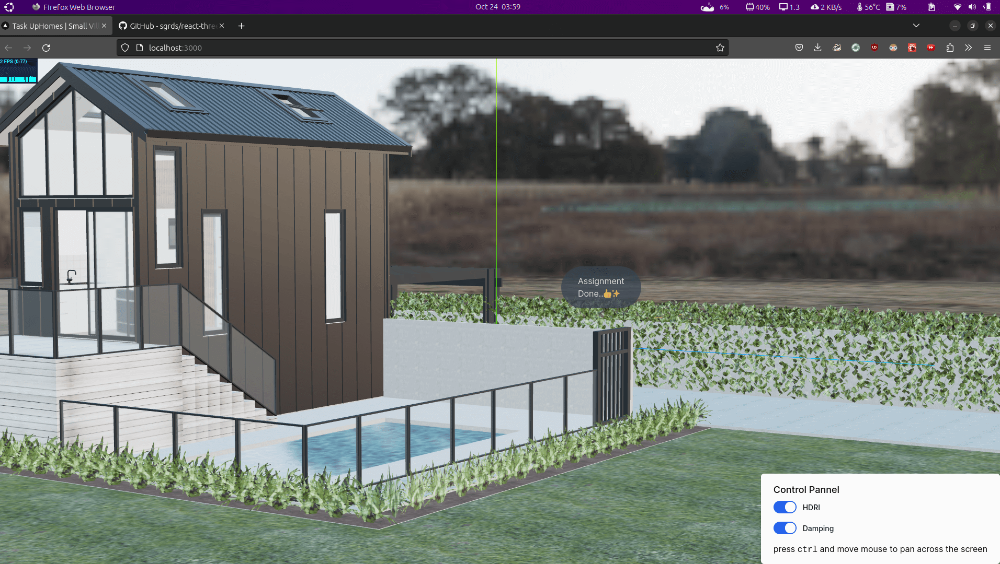

## Objective

Choose a 3D model (preferably a house) and use Three.js to create a scene that renders the model with the camera positioned at the top left of the model, tilted 45 degrees. Ensure the model is interactive, allowing users to rotate, zoom, and pan the model as they wish.

---

## Getting started

Download the repo:

```bash
git clone https://github.com/sgrds/react-three-fiber.git
```

cd into the repo and Run the development server:

```bash
npm run dev
# or
yarn dev
# or
pnpm dev
# or
bun dev
```

Open [http://localhost:3000](http://localhost:3000) with your browser to see the result.

---

## How to build this guide

- Utilized the online resources Sketchfab.com and Polyhaven.com to source a free 3D villa asset and an HDRI environment, respectively.
- Employed Next.js version 13.5 as the development framework, ensuring a streamlined user experience.
- Installed and configured essential libraries for the THREE.js to bring the villa model to life.

### Cloud Integration:

Managed asset storage efficiently by uploading the 3D villa model and HDRI environment to Supabase Storage, ensuring seamless access and performance.

### Interactive User Interface:

- Enhanced the visual appeal by adding atmospheric lighting.
  Integrated the HDRI environment for a realistic and visually immersive background, further enhancing the model's presentation.
- Implemented a control panel to enable users to toggle the HDRI environment on and off, providing greater control over the user experience.
- Enhanced user interaction by adjusting damping settings using OrbitControls.

### Camera Positioning:

Precisely adjusted the camera position to offer viewers the most engaging and immersive perspective of the 3D villa model.
